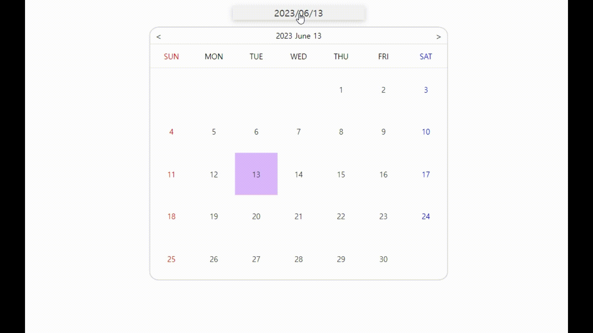
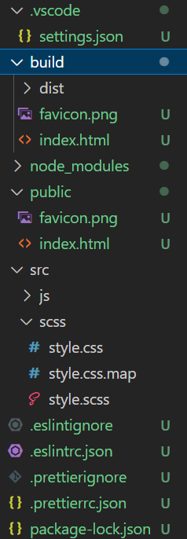
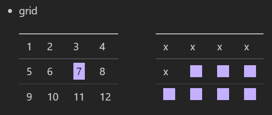

# 30projects_date-picker 📅

[프로젝트 배포 사이트 바로가기](https://badahertz52.github.io/30projects_date-picker/)

### Index

#### <a href="#introduce">1.프로젝트 소개</a>

#### <a href="#tech">2.테크 스킬 & 빌드</a>

#### <a href="study">3.배운 것들</a>

- <a href="#snow-pack">1) snow pack</a>
- <a href="#grid">2) grid-column-start</a>
- <a href="#event">3) event parameter와 class</a>

---

## <div id="introduce">1.프로젝트 소개</div>

- 📷 프로젝트 시뮬레이션

  
  <br/>
  <br/>
  "30projects_date-picker" 프로젝트는 "30개 프로젝트로 배우는 프론트엔드 with React" 수업 중에 하나로, Snowpack,바닐라 자바스크립트와 scss 를 활용해 data-picker 를 구현한 프로젝트인데, 여기서 더 나아가 **리팩토링(구조 분해 할당과 반복되는 과정을 새로운 함수로 만듦) 과정을 거치고 기존의 js를 typescript로 변경하고 반응형 웹을 위해 scss 파일을 수정**했다.

해당 프로젝트의 date picker은 아래의 기능이 있다.

- date picker 기능
  - 캘린더 상단 박스는 처음 화면에서는 오늘 날짜가 표시되고 사용자가 선택한 특정 날짜가 있으면 해당 날짜가 표시된다.
  - 캘린더는 상단 박스를 클릭하면 닫히거나 열리며 캘린더 외부를 클릭해서 닫을 수 도 있다.
  - 캘린더는 상단 박스에 적힌 연도와 월을 기준으로 날짜들을 표시한다.
  - 해당 월의 날짜와 요일들은 자동으로 계산되어 지며 오늘,토요일 과 일요일의 경우 특정한 색깔로 표시된다.
  - 사용자는 원하는 날짜를 선택할 수 있으며, 선택한 날짜는 달력과 상단에 표시된다.
  - 버튼을 통해 이전, 다음 달의 캘린더를 볼 수 있다.
  - 1월에서 이전 버튼을 클릭하면 전년도 12월 달력이 나오고, 12월에서 다음 버튼을 클릭하면 다음 연도의 1월 달력이 표시된다.

## <div id="tech">2.테크 스킬 & 빌드</div>

### 1) 테크 스킬

- html,scss, typescript
- Snowpack

### 2) 빌드

#### Installation

```bash
> npm i
```

#### Run Dev Server

```bash
> npm run dev
```

#### Build

```bash
> npm run build
```

## <div id="study">3.배운 것들</div>

### <div id="snow-pack">1) Snowpack</div>

### A. Snowpack ?

Snowpack은 프론트엔드 빌드 도구이다.
변경 사항이 있을 시 모두 다시 번들해야만 변경사항이 적용되는 번들러(ex Webpack)와 다르게, js의 ESM(ES modules)을 활용해 최초의 빌드 시스템을 생성해 변경된 해당 파일만을 다시 빌드해 브라우저에 적용하므로써 번들 소요 시간을 획기적으로 절약할 수 있다.

### B. Snowpack과 scss, typescript

Snowpack를 사용하면서 scss와 typescript로 작업을 하고 싶다면 별도의 플러그인을 설치해야한다.

- @snowpack/plugin-sass
- @snowpack/plugin-typescript

### C. Snowpack 설정

### a. snowpack.config.js

Snowpack 설정은 snowpack.config.js 파일을 통해 이루어진다.

```js
module.exports = {
  // mount :snowpack 빌드에 사용할 ‘현재 경로‘와 빌드 결과로 연결할 ‘빌드 경로‘를 지정
  mount: {
    //정적 파일 디렉토리, snowpack으로 빌드 되지 않음
    public: { url: "/", static: true },
    //snowpack으로 빟드되는 파일들, scr 디렉토리의 파일들은 url경로로 접근
    src: { url: "/dist" },
    // 빌드되는 파일들은 dist 폴더에 저장됨
  },
  //최적화
  optimize: {
    minify: true,
  },
  plugins: ["@snowpack/plugin-sass"],
};
```

### b. index.html

<details>
<summary>빌드 후 파일 구조</summary>
<div markdown="1">

  

</div>
</details>

- public/index.html

```html
<head>
  <link rel="stylesheet" href="dist/scss/style.css" />
  <script defer src="dist/js/index.js"></script>
</head>
```

index.html에서는 빌드 된 파일들이 저장되는 **dist 폴더** 내의 css와 js 파일들 불러오면 css와 js가 적용된다.

### <div id="grid">2) grid-column-start</div>

캘린더에서 날짜들을 gird를 통해 나열을 했는데, 이때 첫번째 날짜의 요일에 맞추어서 나열의 시작점을 잡아야 했고 그때 사용한게 "grid-column-start" 이다.

grid-column-start는 grid의 시작점을 지정하는 것으로, ,<span style="background-color:gray; color:white"> grid-column-start : 7 </span> 이면 아래의 표에서 "7"라고 쓰여진 곳에서 부터 grid로 지정된 요소들이 나열되기 시작한다.

  

### <div id="event"> 3) event parameter와 class</div>

```js
document.addEventListener("click", (event) => closeCalendar(event));

function closeCalendar(event) {
  //.....
}
```

위의 코드 처럼, "addEventListener"을 통해 이벤트를 주고, 해당 이벤트를 parameter로 받아오려면 addEventListener의 콜백 함수에 parameter로 이벤트를 넘겨주면 되는데, class에서는 어떻게 해야할까?

```typescript
class DatePicker {
  //...
  document.addEventListener("click", this.closeCalendar.bind(this));
  //....
  closeCalendar(event: MouseEvent) {// close calendar
  };
};
new DatePicker();
```

class에서는 addEventListener에서 콜백함수에 별도로 parameter를 넘겨주지 않아도 된다.

---

#### 참고 자료

- https://heropy.blog/2020/10/31/snowpack/

#### favicon 출처

- https://icons8.kr/icons/set/calendar
